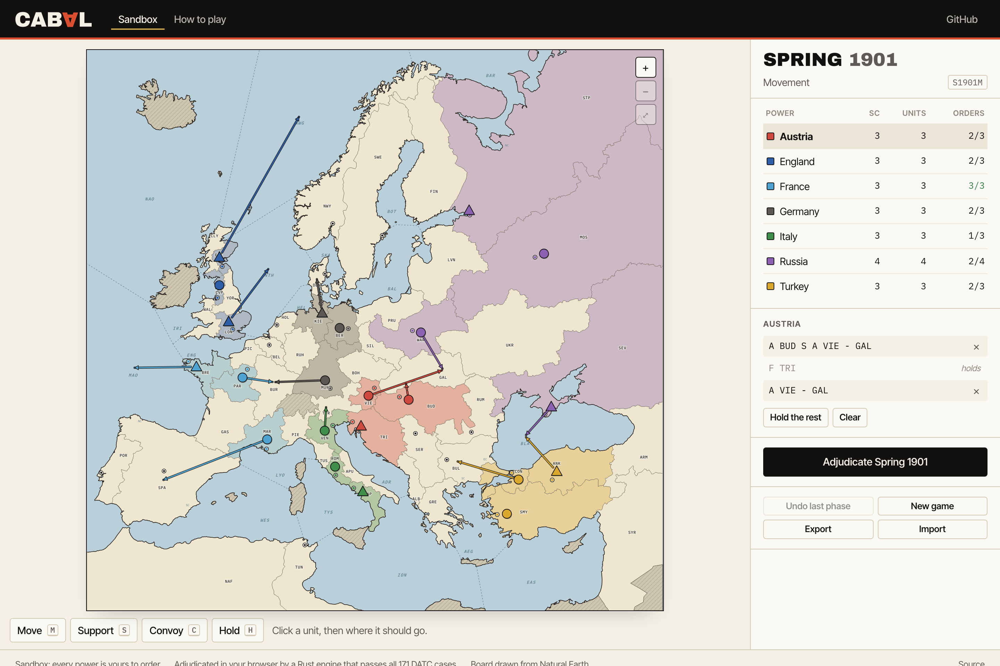
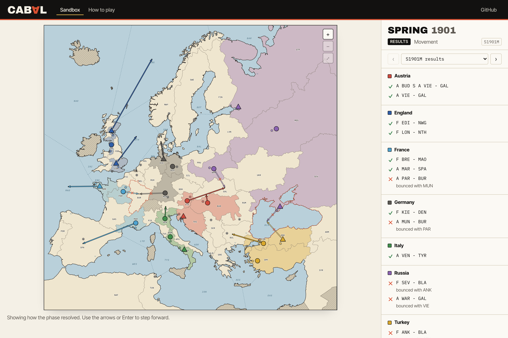
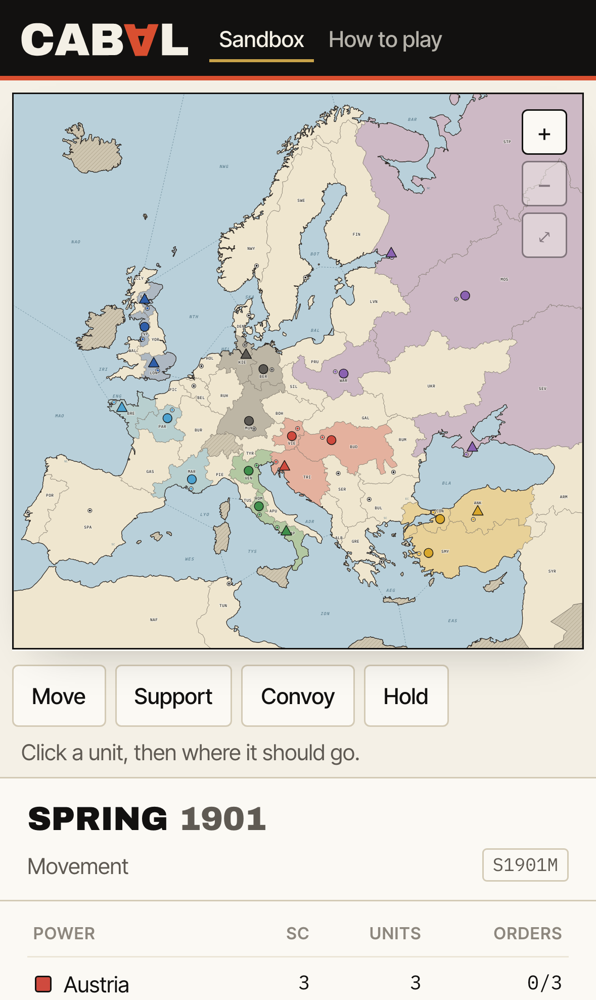
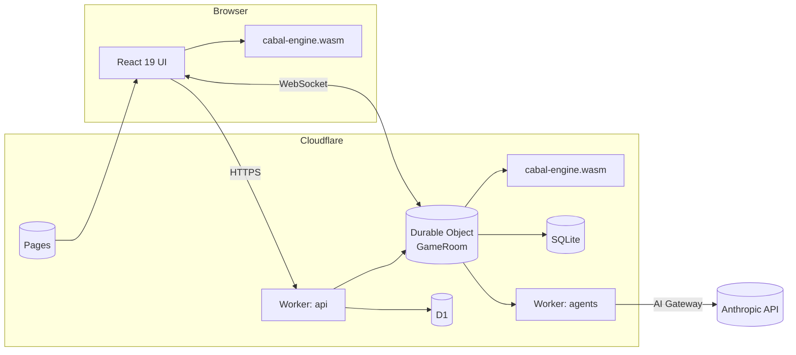
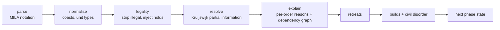

<div align="center">


**Diplomacy with receipts.** Seven powers. One board. Every promise can be sealed, verified, and held against you.

[](https://github.com/KarthikSubramanian07/Cabal/actions/workflows/ci.yml)
[](https://github.com/KarthikSubramanian07/Cabal/actions/workflows/stress.yml)
[](LICENSE)


`diplomacy` `negotiation` `strategy-game` `rust` `webassembly` `cloudflare-workers` `durable-objects` `react` `llm-agents` `datc` `game-theory`

[Play the sandbox](https://playcabal.pages.dev) · [The plan](docs/PLAN.md) · [Architecture](docs/ARCHITECTURE.md) · [Rules decisions](docs/RULES.md) · [Protocol](docs/PROTOCOL.md) · [ADRs](docs/adr/)

</div>

<p align="center">
  
</p>

---

Diplomacy is the greatest negotiation game ever designed and every online version of it feels like a forum from 2006. Cabal keeps the rules exactly (a Rust adjudicator that passes the full Diplomacy Adjudicator Test Cases) and rebuilds everything around them: the classic board you can order from with two clicks, press with cryptographic pledges, a trust ledger that follows you between games, secret cabals, vendettas, ghosts who keep talking after they die, and AI players who negotiate through the same protocol you do.

## What makes it Cabal

| Mechanic | What it does |
|---|---|
| **Pledges** | Attach a sealed commitment to specific orders to any message. After adjudication the engine stamps it `kept` or `broken`. Stabs become public record. |
| **Trust ledger** | A public honour score built from pledges across games, with Bayesian shrinkage so a newcomer starts neutral. Lie all you want; it will be on your profile. |
| **Cabals** | Optional mode. Two or three players are secretly dealt a shared hidden win condition. Revealed at the end. |
| **Vendettas** | Stake rating on a declared goal against a named power with a deadline. Miss it and they collect. |
| **Ghost votes** | Eliminated players keep press and one draw vote. The dead stay dangerous. |
| **AI seats** | Any seat can be a Claude powered agent with a persona, a private diary and a memory of who lied to it. Tables always fill. |
| **No dead games** | Sealed default orders, ready-to-advance deadlines, substitutes and AI takeover after two missed phases. |

None of these change the rules. They are layers that read the adjudication result. See [ADR 0004](docs/adr/0004-cabal-layer-above-adjudication.md).

## The board

The board is the one Diplomacy players know, drawn fresh from real geography. `tools/mapgen` assigns every Natural Earth region (public domain) to one of the 75 classic provinces, dissolves and simplifies them with shared borders intact, cuts the seas along the printed board's straight lines, and checks every drawn border against the engine's adjacency table. Nothing is traced from anyone else's artwork, so the map ships under MIT with the rest of the code.

| Orders, then receipts | On a phone |
|---|---|
|  |  |

Ordering works the way Backstabbr players expect. Click a unit, then where it goes. Click it twice to hold. Press <kbd>S</kbd> to support or <kbd>C</kbd> to convoy, and the buttons under the map do the same on touch screens. Only legal orders are ever offered, fleets moving to Spain, Bulgaria or St Petersburg get a coast picker, and every phase can be replayed, undone, exported and imported as a MILA saved game.

See [tools/mapgen/README.md](tools/mapgen/README.md) for how the map is built and [docs/BRAND.md](docs/BRAND.md) for the palette and wordmark.

## Architecture



- **One engine, two hosts.** The Rust crate is compiled once to WebAssembly. The browser uses it for instant legality checks and what-if previews; the Durable Object uses the same bytes as the authority. They cannot disagree.
- **One object owns one game.** Positions, orders, press, pledges, the deadline alarm and every WebSocket live in a single Durable Object with SQLite. Adjudicate, persist, broadcast: one transaction, no hops.
- **Cross-game data in D1.** Accounts, Glicko-2 ratings per settings cluster, trust ledgers, match history.

Full detail in [docs/ARCHITECTURE.md](docs/ARCHITECTURE.md).

## The engine

`crates/cabal-engine` is a pure, deterministic Diplomacy adjudicator.



- **Algorithm.** DATC v3.0 chapter 5 partial information resolver: every order is a Boolean equation over attack, hold, defend and prevent strengths; `resolve` memoises, detects dependency cycles and applies the two backup rules (circular movement succeeds, convoy paradoxes fail the convoys per Szykman). No "cut supports first" heuristics anywhere.
- **Explanations, not Booleans.** Every outcome says why: `bounced by A Mun`, `support cut by F Kie`, `no convoy path`, `friendly fire`, `paradox`. The UI renders the dependency graph.
- **Editions as data.** 1971, 1982, 2023 and DPTG rulebooks differ only in `Rulebook` fields (convoy intent, civil disorder distance).
- **Tests.** 171 DATC v3.0 cases across movement, retreat and build phases, vendored with attribution from the MIT `diplomacy` crate; property tests for order-independence and no-panic; snapshot tests on explanations; criterion benches; fuzz targets on the parser.
- **Interop.** Orders and saved games use the MILA / Cicero notation, so every published AI Diplomacy harness understands Cabal games.

```sh
cargo run -p cabal-cli -- datc            # run the DATC corpus and print a section report
cargo run -p cabal-cli -- adjudicate game.json
cargo run -p cabal-cli -- explain "ENG: F NTH - HOL" "ENG: A BEL S F NTH - HOL" "GER: A HOL H"
```

## What is built today

| Piece | State |
|---|---|
| `cabal-engine` | 171 of 171 DATC v3.0 cases, property tests, benches, MILA saved games, seals and receipts |
| `cabal-wasm`, `@cabal/engine` | one 201 KB gzipped module for browser and Workers, generated TypeScript types |
| `@cabal/protocol` | zod schemas for every frame, settings, pledges and scoring |
| `apps/server` | GameRoom Durable Object: seats, deadlines, orders, press, sealed pledges with receipts, replay export |
| `apps/web` | the classic board sandbox: click-to-order from the legal list, coast picker, receipts with reasons, phase replay, undo, MILA import and export, phone and desktop |
| `tools/mapgen` | the board itself, generated from Natural Earth and checked against the engine's borders |
| `@cabal/agents` | Claude players with narrative prompts, structured decisions and legal order validation |

## Repository

```
crates/cabal-engine   Rust rules engine (geo, orders, parser, resolver, phases, json, pledges)
crates/cabal-wasm     wasm-bindgen + tsify bindings, TypeScript types generated from Rust
crates/cabal-cli      cabal CLI: datc, adjudicate, explain, bench
packages/engine       @cabal/engine   npm wrapper for the wasm build
packages/protocol     @cabal/protocol zod schemas for the WebSocket and HTTP protocol
packages/agents       @cabal/agents   Claude powered player harness
apps/web              @cabal/web      Vite + React 19 on Cloudflare Pages
apps/server           @cabal/server   Worker + GameRoom Durable Object
tools/mapgen          board generator: Natural Earth to board.json
docs                  plan, architecture, rules, protocol, brand, ADRs
```

## Quickstart

```sh
rustup show && cargo install wasm-pack
corepack enable && pnpm install
pnpm engine:build     # cabal-engine -> packages/engine/pkg
pnpm dev              # web :5173, server :8787
cargo test --workspace && pnpm check
```

## Roadmap

| Phase | Scope | Status |
|---|---|---|
| 0 | Foundation: DATC complete engine, wasm, protocol, GameRoom server, classic board sandbox, Claude players, docs, CI | done |
| 1 | A complete ranked game end to end on playcabal.pages.dev: seven issues, one per engineer ([#6](https://github.com/KarthikSubramanian07/Cabal/issues/6) to [#12](https://github.com/KarthikSubramanian07/Cabal/issues/12)) | issues open |
| 2 | Cabal layer: cabals, vendettas, ghost votes, press modes, variants, spectators | planned |
| 3 | Prediction markets, tournaments, streaming overlay, seasonal ladders | planned |

The full plan, with exit criteria per issue and a risk register, is in [docs/PLAN.md](docs/PLAN.md).

## Research this stands on

Before writing code we read the adjudicators of the MILA `diplomacy` engine, `godip`, the MIT `diplomacy` crate, `stpsyr` and jDip, the DATC v3.0 and "The Math of Adjudication" by Lucas Kruijswijk, the Cicero, DipNet, SearchBot, Welfare Diplomacy, DipLLM and AI Diplomacy papers and harnesses, and the feature sets and complaints of webDiplomacy, Backstabbr, Playdiplomacy, Diplicity and Conspiracy. Thirty-two catalogued real-world adjudication bugs from those projects' issue trackers became regression tests here.

Test data attribution: the DATC v3.0 corpus and standard map adjacency tables are derived from [TedDriggs/diplomacy](https://github.com/TedDriggs/diplomacy) (MIT). The DATC itself is by Lucas B. Kruijswijk.

## License

MIT. See [LICENSE](LICENSE).
