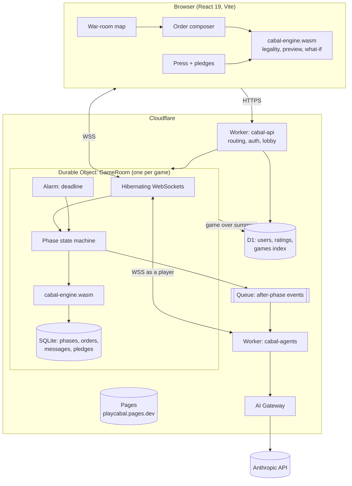
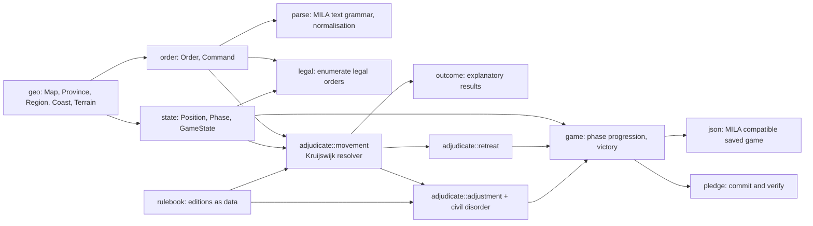
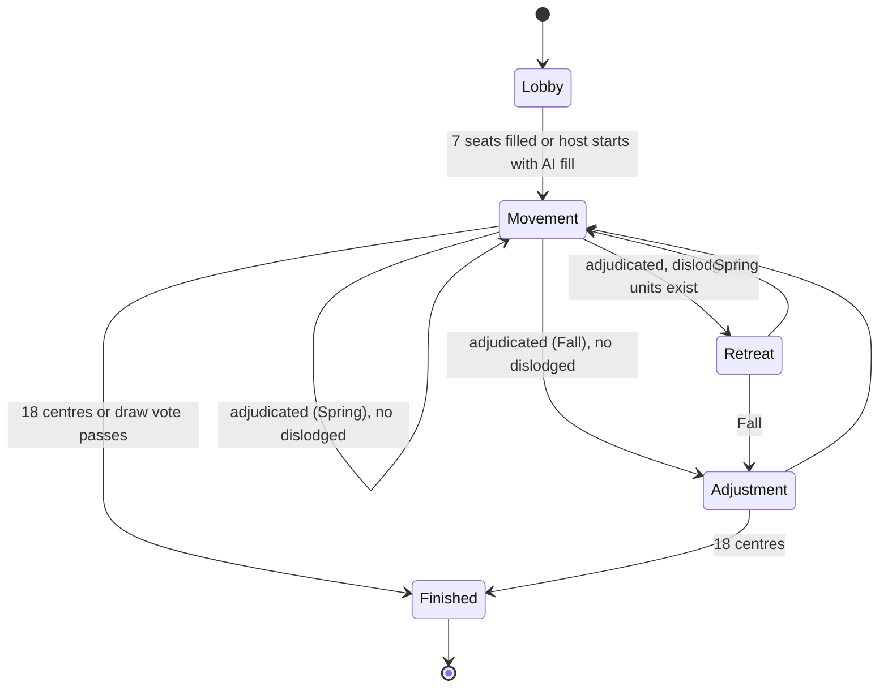

# Architecture

## 1. System overview



Three principles:

1. **One engine, two hosts.** The Rust crate is compiled once to WebAssembly. The browser uses it for instant feedback; the Durable Object uses it as the authority. They cannot disagree because they are the same bytes.
2. **One object owns one game.** All state for a game (positions, orders, press, pledges, deadlines, sockets) lives in one Durable Object with SQLite storage. Adjudication, persistence and broadcast are one transaction. No cross-service hop on the hot path.
3. **Layers above the line never touch the resolver.** Pledges, cabals, vendettas and ratings consume adjudication results. They cannot change them.

## 2. Repository layout

```
cabal/
  crates/
    cabal-engine/    pure Rust: geo, orders, parser, resolver, phases, legality, json, pledges
    cabal-wasm/      wasm-bindgen + tsify bindings, generates TypeScript types
    cabal-cli/       `cabal` CLI: adjudicate, datc, bench, explain, replay
  packages/
    engine/          @cabal/engine  npm wrapper around the wasm-pack output
    protocol/        @cabal/protocol  zod schemas for WebSocket and HTTP messages
    agents/          @cabal/agents  LLM player harness
  apps/
    web/             @cabal/web  Vite + React 19, Cloudflare Pages
    server/          @cabal/server  Worker + GameRoom Durable Object
  docs/              PLAN, ARCHITECTURE, RULES, PROTOCOL, ADRs, diagrams
  .github/           CI, issue and PR templates
```

## 3. The engine (`crates/cabal-engine`)

### 3.1 Module map



### 3.2 Domain types

- `ProvinceId(u8)`: index into the map. `Region { province, coast: Option<Coast> }` is the thing a unit stands on (fleets on `stp` are on `stp(nc)` or `stp(sc)`).
- `Terrain::{Land, Coast, Sea}` on provinces; `Border { a: Region, b: Region, terrain }` on edges. An army crosses `Land` and `Coast` borders, a fleet crosses `Coast` and `Sea` borders. Coastal provinces are represented by one region per coast plus the land region, following the MIT `diplomacy` crate design.
- `Unit { power, kind: Army | Fleet, region }`.
- `Order { power, unit_kind, origin: Region, command }` with `Command::{Hold, Move { dest, via_convoy }, SupportHold { target }, SupportMove { target, dest }, Convoy { army, dest }}` for movement, `RetreatCommand::{Retreat(Region), Disband}` and `AdjustCommand::{Build(kind, Region), Disband(ProvinceId), Waive}`.
- `Outcome` enums explain every result: `Move::{Succeeds, Bounced(by), NoPath, Repelled, LostHeadToHead, FriendlyFire, ...}`, `Support::{Succeeds, Cut(by), Dislodged, Void}`, `Convoy::{Succeeds, Dislodged, Paradox}`.

### 3.3 Resolution

The movement resolver implements the partial information algorithm from DATC v3.0 chapter 5.E (Kruijswijk). Every order has a Boolean result that never changes once decided. `adjudicate(order, optimistic)` evaluates the rule equations (attack, hold, defend, prevent strength, path, support cut, convoy) using optimistic or pessimistic values for anything undecided; `resolve(order, optimistic)` memoises, detects dependency cycles with a `recursion_hits` counter, and applies the backup rule (circular movement succeeds; convoy paradox fails the convoys per Szykman). Illegal orders are stripped before resolution and never influence it. After resolution a final explanation pass turns Booleans into `Outcome` values and a dependency graph for the UI.

Pre-processing decides statically whether an adjacent move uses a convoy (edition policy), matches supports and convoys to moves, and identifies head-to-head pairs (never when either side is convoyed).

### 3.4 Determinism and testing

- No I/O, no randomness in adjudication. Civil disorder tie breaks are alphabetical by province name.
- DATC v3.0 corpus (171 cases, Main, Retreat, Build, editions) drives `tests/datc.rs`. A second corpus asserts full post-state positions. Both are JSON under `crates/cabal-engine/tests/data`.
- Property tests (`proptest`): random legal order sets never panic, resolution is independent of order submission sequence, relabelling powers relabels outcomes.
- Snapshot tests (`insta`) on explanations for the DipMath figures.
- `criterion` benches: full board adjudication, legal order enumeration.
- `cargo fuzz` target on the text parser.

## 4. WebAssembly boundary (`crates/cabal-wasm`, `packages/engine`)

- Built with `wasm-pack build --target web`. The `.wasm` is imported by Vite via `?url` and by Wrangler through a `CompiledWasm` rule; both call the generated `init` once.
- `tsify` derives TypeScript types for every struct crossing the boundary, so `adjudicate(state, orders)` is typed end to end. Data crosses as structured clone via `serde-wasm-bindgen`, never JSON strings.
- Exposed API: `standardMap()`, `initialState()`, `parseOrder(text)`, `legalOrders(state, power)`, `adjudicate(state, orders, rulebook)`, `applyRetreats`, `applyAdjustments`, `toSavedGame`, `fromSavedGame`, `pledgeCommit`, `pledgeVerify`.

## 5. Server (`apps/server`)

### 5.1 GameRoom Durable Object



- Connections use the WebSocket Hibernation API via `partyserver`. Each socket is tagged with `userId` and `seat`.
- One alarm per object holds the phase deadline. On alarm: apply sealed defaults or holds for missing orders, adjudicate with the WASM engine, persist, broadcast, schedule the next alarm. The transaction is atomic inside the object.
- "Ready to advance": when all seated players mark ready, the deadline collapses to now.
- Every phase is an append-only row: `phases(id, name, state_json, orders_json, results_json, adjudicated_at)`. Replays are reads.

### 5.2 SQLite schema (per game)

```
game(id, variant, rulebook, settings_json, status, created_at)
seats(seat, power, user_id, kind human|ai, joined_at, eliminated_at)
phases(seq, name, deadline_at, state_json, orders_json, results_json, adjudicated_at)
orders(phase_seq, power, order_text, submitted_at, is_default)
messages(id, phase_seq, sender, recipient, body, sent_at)
pledges(id, message_id, pledger, audience, commitment, revealed_orders, verdict, verified_at)
votes(kind, power, value, phase_seq)
```

### 5.3 Cross-game (D1)

`users`, `credentials` (passkeys), `sessions`, `games_index`, `ratings(user_id, cluster, rating, rd, volatility)`, `trust(user_id, kept, broken, updated_at)`.

## 6. Protocol

The WebSocket protocol is specified in [PROTOCOL.md](PROTOCOL.md) and enforced with zod schemas in `@cabal/protocol`. Order text follows the MILA / Cicero notation (`A PAR - BUR`, `F NTH C A LON - BRE`, `A LON - BRE VIA`) so existing AI research tooling and saved games interoperate.

## 7. Agents (`packages/agents`)

An agent is just another client. It receives the same state and message stream, builds a narrative prompt (board story, legal orders, diary, relationships), asks Claude for reasoning plus structured output, validates orders against the legal list with a repair pass, and submits through the protocol. Pledges are first class: the agent can seal commitments and reads the trust ledger of opponents.

## 8. Web (`apps/web`)

- Vite 8, React 19, TypeScript strict, no component library. Typography: Instrument Serif for display, Geist for UI, Geist Mono for the order log.
- The map is a stylised war-room graph: provinces as positioned nodes with territory glyphs, adjacency as routes, sea zones as darker fields. Rendered as SVG with CSS custom properties per power. A traced geographic map is a phase 1 deliverable.
- Order entry is tap-tap: tap a unit, tap a destination; support and convoy are inferred from the second tap when unambiguous, otherwise a radial picker opens. The local engine colours legality live.
- State is one reducer fed by the protocol; the engine's `Outcome` explanations render as an annotated order log.

## 9. Deployment

- `apps/web` deploys to Cloudflare Pages as `playcabal.pages.dev` on every merge to `main`.
- `apps/server` deploys with `wrangler deploy` from CI using `CLOUDFLARE_API_TOKEN`. Durable Object migrations are declared in `wrangler.jsonc`.
- CI (`.github/workflows/ci.yml`): Rust fmt, clippy, tests, DATC, wasm build with a size gate; Node typecheck, unit, workerd tests, Playwright; deploy jobs on `main`.
- Nightly (`stress.yml`): fuzzing, property tests with a larger case budget, and an AI arena game.

## 10. Security and fairness

- Clients never assert who they are. The socket tag from the authenticated join is the identity.
- Orders are only accepted for the seat bound to the socket.
- Pledge commitments are BLAKE3 hashes over canonical order text plus a 128 bit nonce; sealed pledges reveal after adjudication.
- Rate limits on room creation and message send via Workers rate limiting bindings.
- Multi-account heuristics and moderation hooks are phase 1 issue 7.
