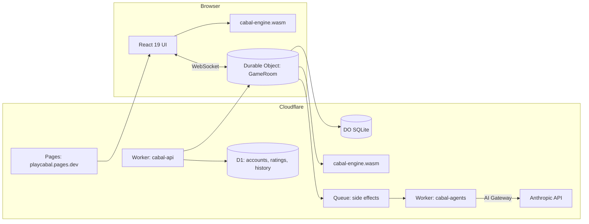

# Cabal: the plan

> Diplomacy with receipts. Seven powers, one board, and every promise can be sealed, verified, and held against you.

This document is the master plan. It covers the product, the rules, the technical architecture at a glance, the phased roadmap, the phase 1 split across seven engineers, and the risks. Deeper material lives in [ARCHITECTURE.md](ARCHITECTURE.md), [RULES.md](RULES.md), [PROTOCOL.md](PROTOCOL.md) and the [ADRs](adr/).

## 1. What we are building

Cabal is an online negotiation strategy game built on the adjudication rules of Diplomacy (7 powers, 34 supply centres, simultaneous orders, no dice) with a new layer on top that makes trust itself a game object:

- **Pledges.** A message can carry a sealed commitment to specific orders. After adjudication the engine stamps it `kept` or `broken`. Nobody has to argue about who stabbed whom.
- **Trust ledger.** Every player carries a public honour score derived from kept and broken pledges across games, with Bayesian shrinkage so a new player is neither saint nor villain.
- **Cabals.** Optional mode: at game start some players are secretly dealt into two or three person cabals with a shared hidden win condition. Reveal at the end.
- **Vendettas.** Publicly stake rating on a declared goal against a named power with a deadline. Fail and the target collects.
- **Ghost votes.** Eliminated players keep press and one draw vote, so the dead stay dangerous.
- **AI players.** Any seat can be filled by a Claude powered agent that negotiates, pledges, and betrays through the same protocol humans use.

Everything above the line is a layer. The adjudicator underneath is a pure, deterministic Rust engine that passes the full Diplomacy Adjudicator Test Cases (DATC v3.0) and never knows the cabal layer exists.

### Why this and not another webDiplomacy

We surveyed webDiplomacy, Backstabbr, Playdiplomacy, Diplicity and the late Conspiracy app, plus the AI Diplomacy work from Meta (Cicero), Mila, Good Start Labs and the Welfare Diplomacy benchmark. The ten loudest complaints across platforms:

1. Missed turns and abandoned games (webDiplomacy counts 333k NMRs).
2. Deadline handling that punishes the whole table.
3. Counter-intuitive order entry.
4. Dated map rendering and UI.
5. No real mobile experience.
6. Unreliable notifications.
7. Multi-accounting and metagaming witch hunts.
8. Opaque ratings that mix unlike game settings.
9. Paywalled or missing variants.
10. Thin onboarding and dead press.

Cabal answers each: sealed default orders and one-tap substitutes for NMRs, soft deadlines with "ready to advance", a tap-tap order UI with live legality from the in-browser engine, the classic board drawn from public domain geography in a distinctive brand palette, mobile-first layout with push notifications, one Glicko-2 rating per settings cluster, free variants, and AI seats so a table can always start.

## 2. Product pillars

| Pillar | What it means in practice |
|---|---|
| Correct | Full DATC v3.0 compliance, property tests, fuzzing, deterministic replays. Rule variants are data, not forks. |
| Legible | Every order outcome carries an explanation (`bounced by A Mun`, `support cut by F Kie`, `convoy paradox: Szykman`). Every pledge has a verdict. |
| Fast | Orders validated in the browser via WebAssembly in under a millisecond. Adjudication of a full board in microseconds. |
| Social | Press modes, pledges, cabals, vendettas, ghosts, spectators. The negotiation is the game. |
| Always playable | AI seats, substitutes, sealed defaults, live and async pacing. |
| Familiar | The classic 1901 board and Backstabbr-style ordering, so Diplomacy players feel at home on the first click. The brand (ink, bone, brass, vermilion, the turned A) frames the board without replacing it. |

## 3. Rules baseline

- Rulebook: 2023 Renegade edition as codified by DATC v3.0. Every DATC chapter 4 issue has an explicit choice recorded in [RULES.md](RULES.md).
- Convoy paradoxes: Szykman rule. Circular movement succeeds. Multi-route convoys fail only when every route is cut.
- Convoy intent: explicit `via convoy` or a same-power fleet ordered to convoy (2023). No fallback to land when the convoy is disrupted.
- Civil disorder disbands: 2023 distance-to-owned-supply-centre rule, fleets before armies, then alphabetical.
- Victory: 18 supply centres after a Fall phase. Draws by vote, DIAS by default (all survivors included).
- Scoring: Sum-of-Squares for draws, solo takes the pot. Rating: Glicko-2, one rating per settings cluster (press mode x pacing x variant).
- Map: classic 1901 Europe, 75 provinces, 34 supply centres, 7 powers. Variant maps are data files.

## 4. Architecture at a glance

One Rust crate, `cabal-engine`, is compiled once with `wasm-bindgen` and loaded in two places: the browser (instant legality checks, order preview, what-if sandbox) and the `GameRoom` Durable Object (authoritative adjudication). The Durable Object owns one game: its SQLite tables, its WebSocket connections, and one alarm for the phase deadline. Cross-game data (accounts, ratings, match history) lives in D1. Full detail in [ARCHITECTURE.md](ARCHITECTURE.md).

## 5. Roadmap

### Phase 0: Foundation (done, September 2026)

- Monorepo, CI, docs, ADRs.
- `cabal-engine`: map, orders, parser, legality, Kruijswijk resolver, retreats, builds, civil disorder, DATC harness, legal order enumeration, MILA-compatible JSON, pledge commitments.
- `cabal-wasm` + `@cabal/engine` npm package with generated TypeScript types.
- `@cabal/protocol`: zod schemas for the WebSocket protocol.
- `apps/server`: `GameRoom` Durable Object skeleton (create, join, submit orders, deadline alarm, adjudicate, broadcast) with workerd tests.
- `apps/web`: the classic board generated by `tools/mapgen`, a click-to-order sandbox with receipts, replay, undo and saved games.
- `packages/agents`: LLM player harness skeleton.

### Phase 1: A complete game, end to end (7 issues, one per engineer)

Goal: seven humans (or bots) can play a full ranked game of classic Diplomacy on playcabal.pages.dev with press and pledges, from lobby to draw or solo, on phone or desktop.

| # | Issue | Owner area | Exit criteria |
|---|---|---|---|
| 1 | Engine: order normalisation, coast inference, legal order enumeration, all 171 DATC cases green including the 7 currently skipped | Rust | `cargo test` green, zero `ignore`, proptest + fuzz targets in CI |
| 2 | Engine: full game state machine, MILA JSON round trip, replay determinism, criterion benches, wasm size budget | Rust | Any saved game replays bit-identically; wasm under 400 KB gzip |
| 3 | Server: GameRoom lifecycle, deadlines, NMR policy (sealed defaults, substitutes), press channels, pledge verification, persistence | TS / DO | 7-client workerd integration test plays a full game |
| 4 | Web: map and order entry (tap-tap orders, coasts, convoys, retreats, builds), phase results overlay, replay scrubber | React | Playwright covers every order type on phone and desktop |
| 5 | Web: press, pledges and trust ledger UI, lobby, notifications, PWA install | React | Pledge lifecycle visible end to end; Lighthouse PWA pass |
| 6 | Agents: Claude players (persona, diary, pledges), arena runner, nightly eval in CI | TS / LLM | Bot completes a 1901 to 1910 game with zero illegal orders |
| 7 | Platform: identity (passkeys + magic link), D1 schema, Glicko-2 ratings, deploy pipeline, observability, SEO, moderation hooks; stretch: Discord bot and email digests for press and reminders | TS / CF | Zero-touch deploy on merge; rating updates after each game |

Each issue is written up in full on GitHub with scope, non-goals, interfaces it must honour, and a test plan: [#6](https://github.com/KarthikSubramanian07/Cabal/issues/6), [#7](https://github.com/KarthikSubramanian07/Cabal/issues/7), [#8](https://github.com/KarthikSubramanian07/Cabal/issues/8), [#9](https://github.com/KarthikSubramanian07/Cabal/issues/9), [#10](https://github.com/KarthikSubramanian07/Cabal/issues/10), [#11](https://github.com/KarthikSubramanian07/Cabal/issues/11), [#12](https://github.com/KarthikSubramanian07/Cabal/issues/12).

### Phase 2: The Cabal layer

- Secret cabals with hidden objectives, vendetta wagers, ghost votes, draw voting UI, post-game reveal screen.
- Press modes: public-only, gunboat, whisper budgets, anonymous press.
- Variants: Fog of War, Build Anywhere, Chaos, plus a variant map format with a loader.
- Spectator mode with delayed board and live order log.

### Phase 3: World

- Prediction market for spectators (play money), tournaments and brackets via Workflows, replay sharing with OG images, streaming overlay, mobile push, Steam-style profiles, seasonal ladders.

## 6. Non-goals for phase 1

- No variant maps (data format is designed, one map ships).
- No real-money anything, ever.
- No native apps; PWA only.
- No voice or video press.

## 7. Risks and mitigations

| Risk | Mitigation |
|---|---|
| Adjudicator subtle bugs | DATC v3.0 corpus, second oracle corpus (position-based), property tests, fuzzing, explanation graph for debugging |
| WASM in Durable Object cold start | Module instantiated once per isolate, size budget enforced in CI, benchmark gate |
| LLM players break protocol | Legal order list in prompt, lenient parser with repair pass, hard fallback to hold, per-seat budget cap |
| Abandoned games | Sealed defaults, substitutes, AI takeover after two missed phases, reliability rating |
| Scope creep | Cabal mechanics are all post-adjudication layers; the engine API is frozen after phase 1 issue 2 |

## 8. Success metrics for phase 1

- 100 percent DATC v3.0, zero skipped cases.
- A full 7 seat game completes on production with no manual intervention.
- Time from landing page to a game in progress under 60 seconds (AI seats fill the table).
- p95 order submit round trip under 150 ms from a browser in Europe or North America.
